Title: 2017CD第七週
Date: 2017-02-28 11:00
Category: Course
Tags: brython, w7
Slug: 2017springCD-Week7
Author: 40423248

###補充0.9dev(Pyslvs 0.9-beta.1)左側邊的部分(藍框部分-3)的合成介面介紹:
####在前面的部份有到說一使用程式就會直接跳出,是因為按了Process(處理)這個按鈕,這個功能是還沒有完成的,所以還不能用,在這邊對可以用的功能來試用:

<!-- PELICAN_END_SUMMARY -->

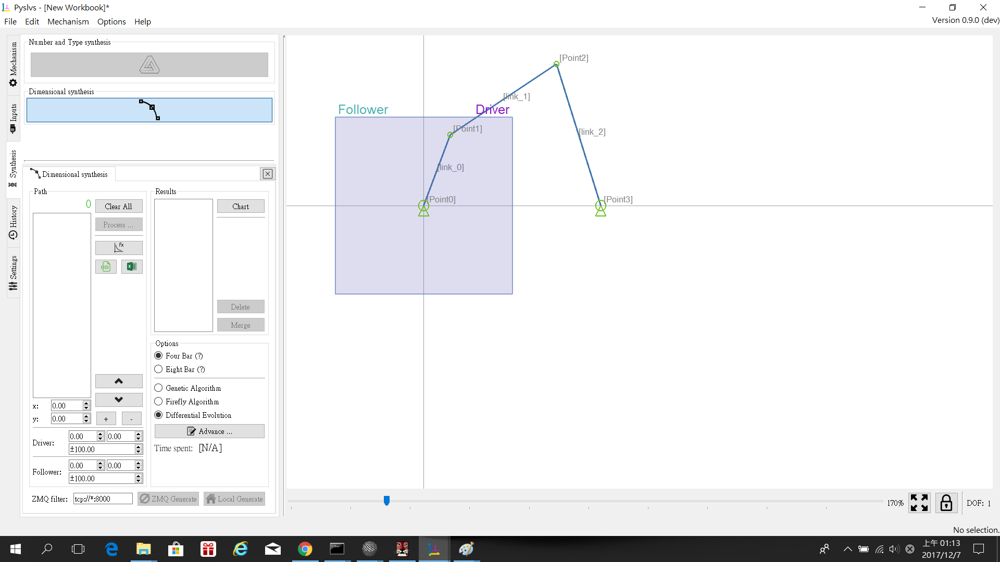

###藍色框中的內容(Path):
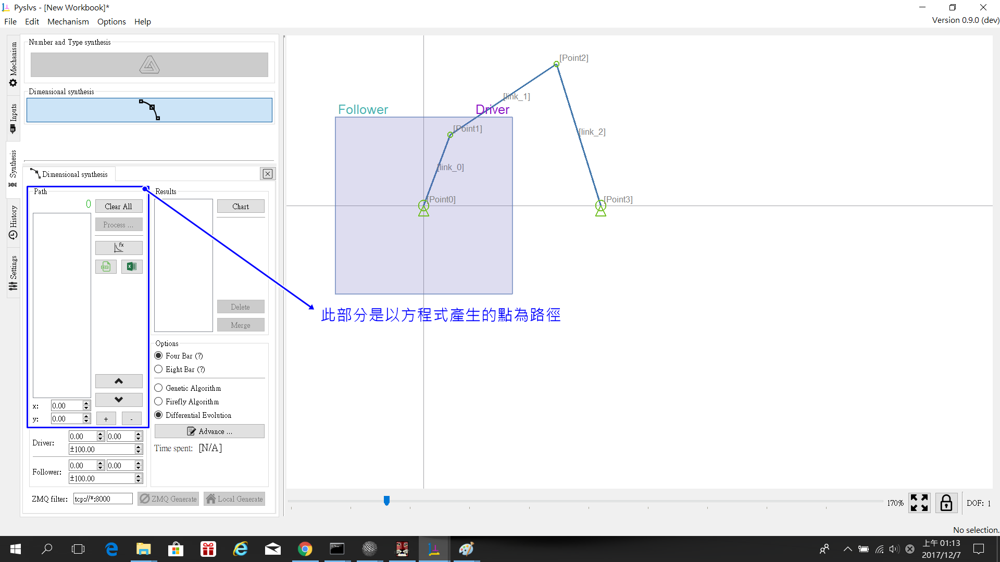

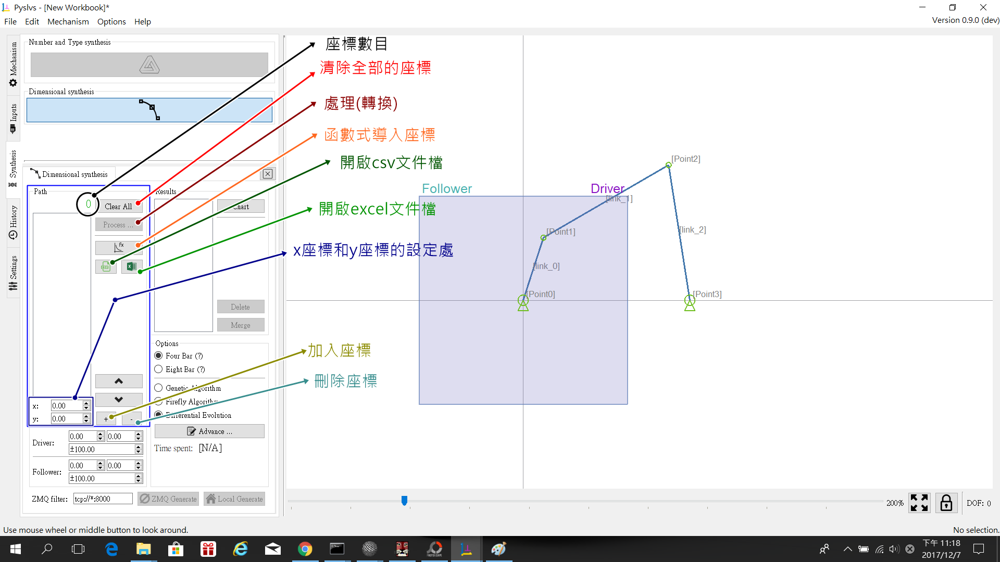
####1.座標數目:顯示白框內目前有的座標數量
####2.清除全部的座標:刪除白框內的所有座標
####3.處理(轉換):此功能暫時無法使用,按了程式會跳掉
####4.函數式導入座標:用此功能所提供的四個函數式來產生連續的座標路徑,可以任意設定變數值及範圍變化,介面如下圖:
####Formula:
####(1)f(x)=kx+c  
####(2)f(x)=kx^2+c
####(3)f(x)=k*cos(x*π/180)+c
####(4)f(x)=k*sin(x*π/180)+c
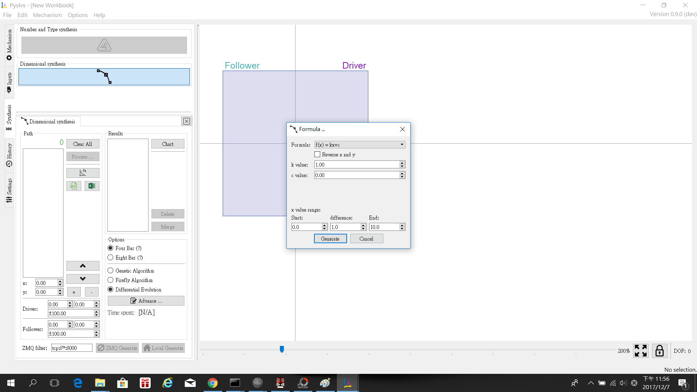
####5.開啟csv文件檔:從外部開啟csv檔來導入座標
####6.開啟excel文件檔:從外部開啟excel檔來導入座標
####7.x座標和y座標的設定處:這邊可以任意設定x和y的座標點
####8.加入座標:此按鈕可以把7.部分的座標加入到白框內
####9.刪除座標:此按鈕可以在白框內選取的座標給移除
###備註:
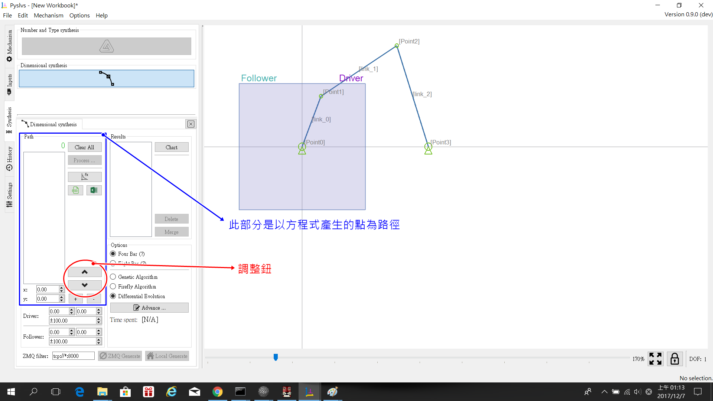
####圖中以紅圈圍起來的兩個按鈕似乎功能不穩,點擊按鈕會讓程式跳掉

###綠色框中的內容:
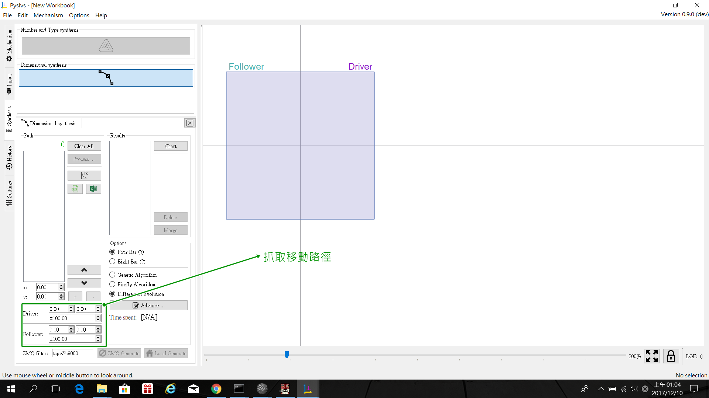
####可以看到裡面有Driver和Follower這兩個選項,這兩個裡面有三個可調整的細節,上面兩個並排的是x和y的位置,下面的是調整左邊畫布區的抓取方框大小,如下圖:
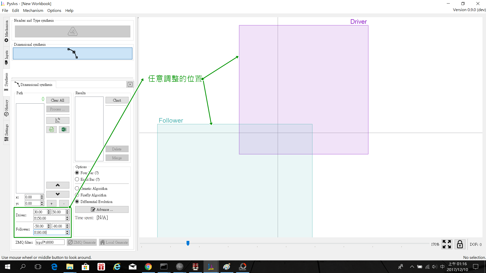
####紫色的Driver方框是用來抓取主動件的運動路徑,淺綠色的Follower方框是用來抓取從動件的運動路徑,範圍放的越大,轉換成運動圖的計算時間越長,相反的,範圍放的越小,計算時間越短

###紅色框中的內容:
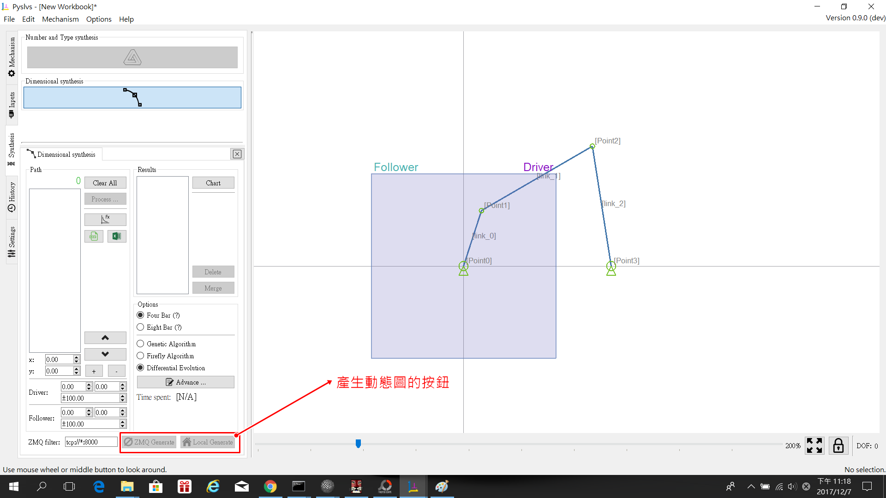
####1.ZMQ generate:

####2.Local Generate:以函數式產生的座標來生成另外的連桿運動圖,在程式內部執行,有座標時點擊按鈕會出現該視窗,如下圖:
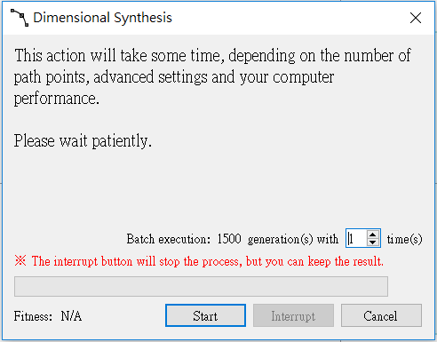

###橙色框中的內容:
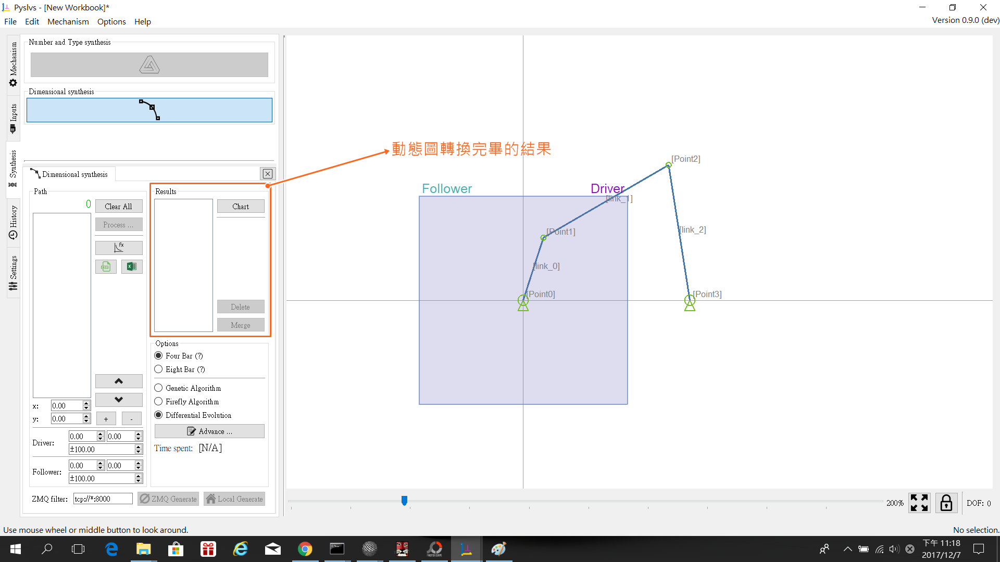
####1.白色框中出現的會是完成的動態圖
####2.chart按鈕:此功能未開放,按了程式會跳出
####3.delete按鈕:刪除產生的動態圖
####4.merge按鈕:此功能未開放,按了程式會跳出

###棕色框中的內容:
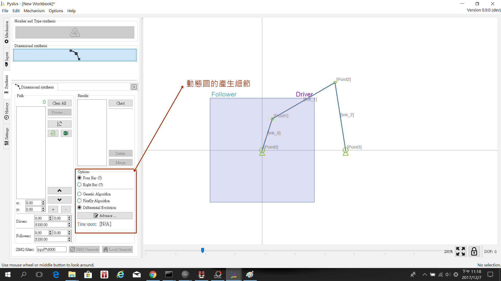
####1.Four bar:產生的動態圖為四連桿
####2.Eight bar:產生的動態圖為八連桿

####3.Genetic Algorithm:此功能是基因演算法(遺傳演算法),
####簡介:
####基因演算法則的基本理論是由 Holland 於 1975 年首先提倡，是基於自然選擇過程的一種最佳化搜尋機構。
####基因演算法則的三個主要運算子為複製 (reproduction)、交配 (crossover)、以及突變 (mutation)。
####基因演算法是模仿兩性生殖的演化機制，使用交配、突變等機制，不斷改進群體適應的一種演算法。此方法廣泛被用在各個人工智慧領域，尤其是在最佳化問題上，遺傳演算法的表現往往相當優異。

####4.Firefly Algorithm:此功能是螢火蟲演算法,
####是一種啟發式算法，靈感來自於螢火蟲閃爍的行為。螢火蟲的閃光，其主要目的是作為一個信號系統，以吸引其他的螢火蟲，其假設為:
####螢火蟲不分性別，這樣一個螢火蟲將會吸引到所有其他的螢火蟲
####吸引力與它們的亮度成正比，對於任何兩個螢火蟲，不那麼明亮的螢火蟲被吸引，因此移動到更亮的一個，然而，亮度又隨著其距離的增加而減少
####如果沒有比一個給定的螢火蟲更亮的螢火蟲，它會隨機移動
####亮度應與目標函數聯繫起來。螢火蟲算法是以自然為靈感的啟發式優化算法

####程式範例:
using System;
namespace FireflyAlgorithm
{
  class FireflyProgram
  {
    static void Main(string[] args)
    {
      Console.WriteLine("Begin firefly demo");
      // Code here
      Console.WriteLine("End firefly demo");
      Console.ReadLine();
    }
    static void ShowVector(double[] v, int dec, bool nl)
    {
      for (int i = 0; i < v.Length; ++i)
        Console.Write(v[i].ToString("F" + dec) + " ");
      if (nl == true)
        Console.WriteLine("");
    }
    static double[] Solve(int numFireflies, int dim,
      int seed, int maxEpochs) { . . }
    static double Distance(double[] posA,
      double[] posB) { . . }
    static double Michalewicz(double[] xValues) { . . }
    static double Error(double[] xValues) { . . }
  } // Program
  public class Firefly : IComparable<Firefly>
  {
    // Defined here
  }
}

####5.Differential Evolution:此功能是差異進化演算法(微分進化演算法),

####6.Adavance:這裡可以調整生成動態圖的細節
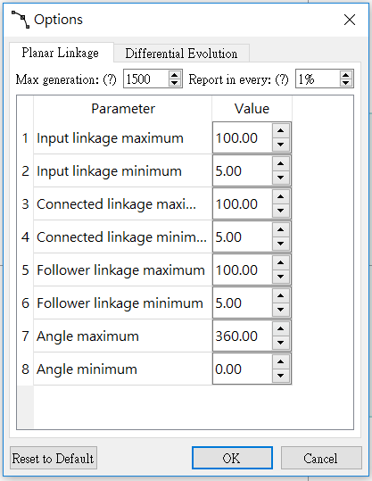

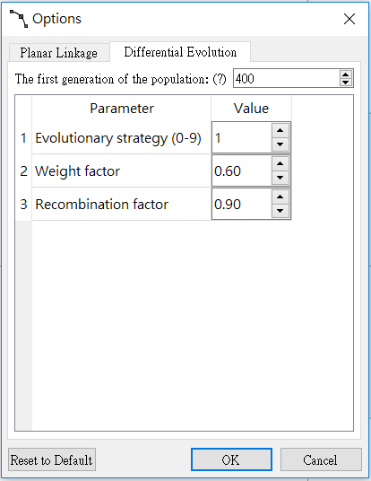

####7.Time spent:計算生成動態圖的時間

###以下是使用的概況:
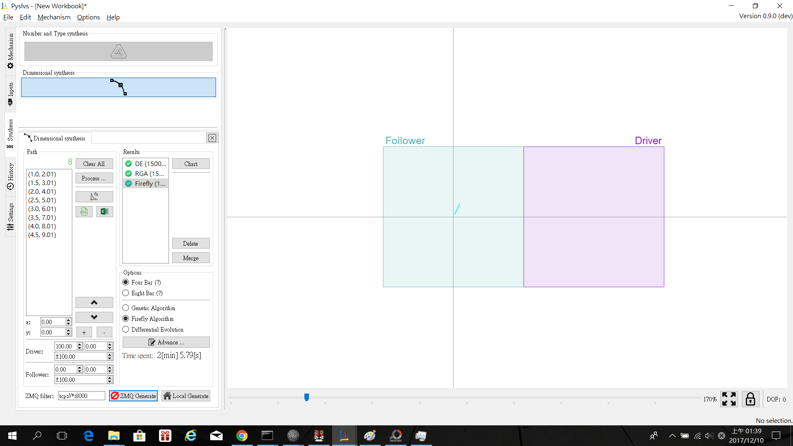
####在路徑中的白框內已經透過函數式功能產生了八個座標點,並透過Local Generate功能產生了三種動態圖(Genetic Algorithm, Firefly Algorithm, Differential Evolution),動態圖的樣子如下:
####Genetic Algorithm(四連桿):
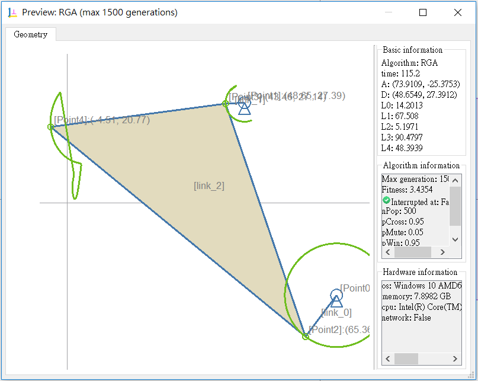

####Firefly Algorithm(四連桿):
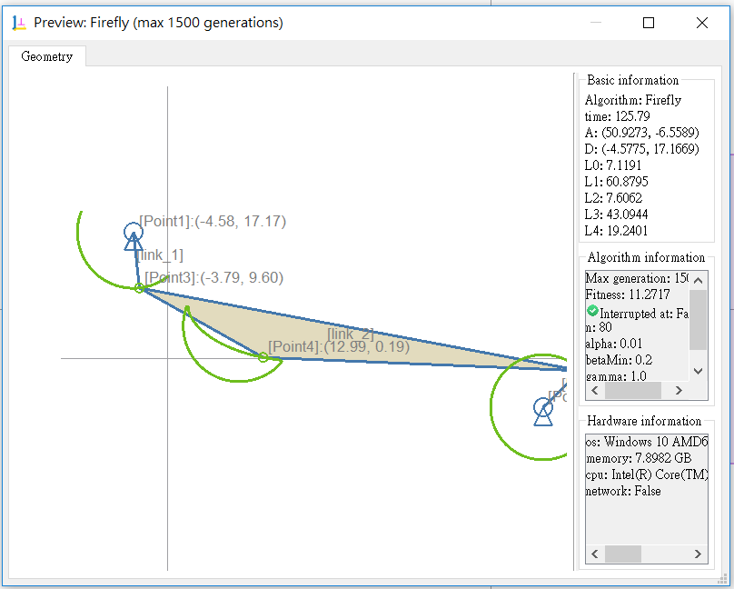

####Differential Evolution(四連桿):
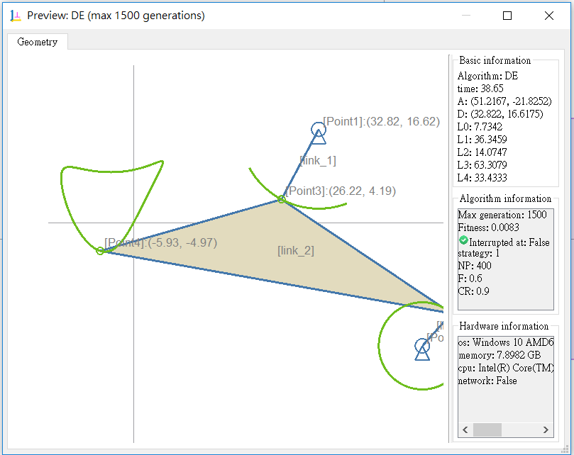

####Genetic Algorithm(八連桿):
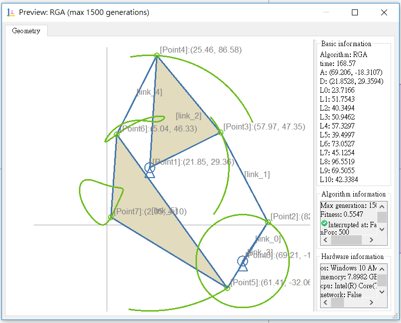

####Firefly Algorithm(八連桿):
####無法產生,程式會跳掉

####Differential Evolution(八連桿):

####輸入一樣的數值,如用函數式f(x)=kx+c , 生k=2 , c=1 , x start from=1 , difference=0.5 ,end=5 ,生成的動態圖都有可能不一樣,好像是亂數決定的感覺,而產生的動態圖似乎還不太穩定,有時會出現感件全部不見,隔幾秒後才會出現,然後又消失,還有基因演算法和螢火蟲演算法用的時間會比較久,目前快的還是差異進化演算法

